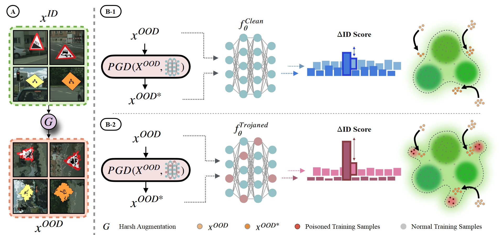

Scanning for trojan (backdoor) in deep neural networks is crucial due to their significant real-world applications. There has been an increasing focus on developing effective general trojan scanning methods across various trojan attacks. Despite advancements, there remains a shortage of methods that perform effectively without preconceived assumptions about the backdoor attack method. Additionally, we have observed that current methods struggle to identify classifiers trojaned using adversarial training. Motivated by these challenges, our study introduces a novel scanning method named TRODO (TROjan scanning by Detection of adversarial shifts in Out-of-distribution samples). TRODO leverages the concept of "blind spots"—regions where trojaned classifiers erroneously identify out-of-distribution (OOD) samples as in-distribution (ID). We scan for these blind spots by adversarially shifting OOD samples towards in-distribution. The increased likelihood of perturbed OOD samples being classified as ID serves as a signature for trojan detection. TRODO is both trojan and label mapping agnostic, effective even against adversarially trained trojaned classifiers. It is applicable even in scenarios where training data is absent, demonstrating high accuracy and adaptability across various scenarios and datasets, highlighting its potential as a robust trojan scanning strategy.